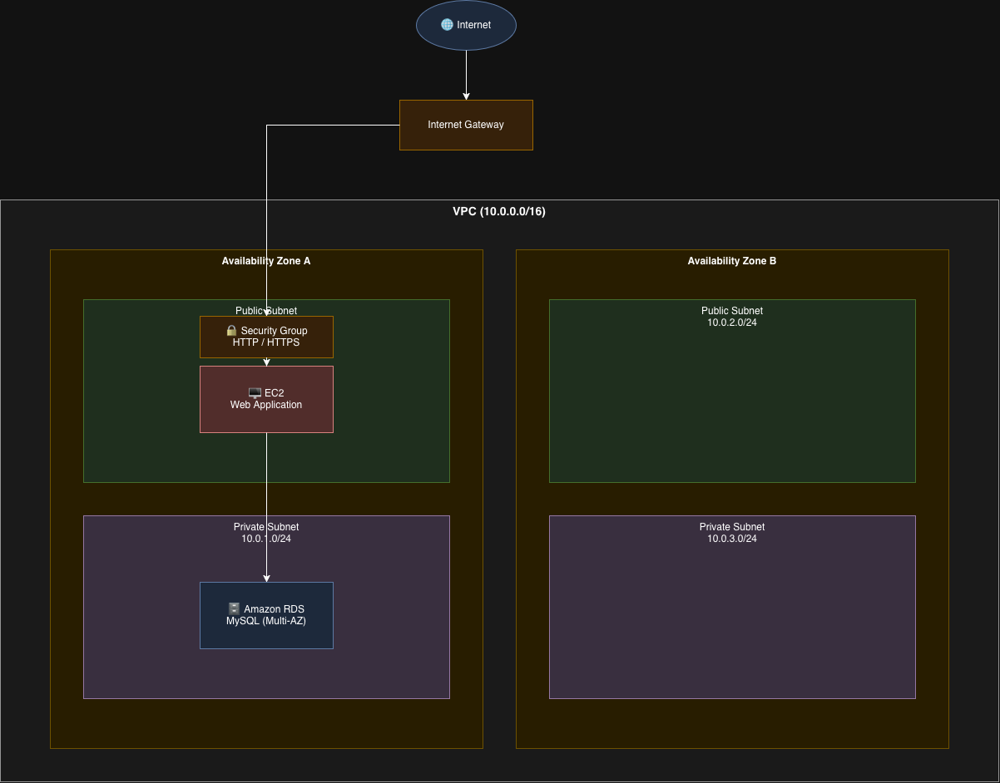

# ☁️ AWS VPC & EC2 Web Application Deployment

---

## 📌 Overview

A hands-on AWS project demonstrating how to design and deploy a secure Virtual Private Cloud (VPC) and launch a Node.js web application on an EC2 instance, following AWS best practices for a three-tier architecture.

---

## 🏗️ Architecture

The solution includes:

- 🌐 **Custom VPC** with CIDR `10.0.0.0/16`
- 🔀 **Public and Private Subnets** across multiple Availability Zones
- 🚪 **Internet Gateway** for outbound internet access
- 🛣️ **Route Tables** for traffic control
- 🔒 **Security Group** allowing HTTP (80) and HTTPS (443)
- 🖥️ **EC2 Instance** (Amazon Linux 2023, t2.micro)
- ⚙️ **User Data Script** for automated setup
- 🗄️ **Amazon RDS MySQL** (design reference)
- ⚖️ **Elastic Load Balancing** (design reference)

---

## 🧰 Services Used

| Service | Purpose |
|---|---|
| Amazon VPC | Network isolation |
| Amazon EC2 | Virtual server |
| Amazon RDS | Managed database |
| Security Groups | Instance-level firewall |
| Internet Gateway | Internet connectivity |
| Route Tables | Traffic routing |
| IAM | Access management |

---

## 🚀 Deployment Steps

1. Created a custom VPC with CIDR `10.0.0.0/16`
2. Created Public and Private Subnets in two Availability Zones
3. Attached Internet Gateway and configured Route Tables
4. Created a Security Group allowing HTTP and HTTPS
5. Launched an EC2 instance inside the Public Subnet
6. Attached a User Data script to install Node.js and start the app
7. Tested the application via the instance's Public IPv4 address

---

## 📂 Project Structure

aws-vpc-ec2-web-app/
│
├── README.md
├── learning-outcomes.md
├── linkedin-post.md
├── user-data-script.sh
├── architecture-diagram.drawio
├── architecture-diagram.png
├── LICENSE
├── .gitignore
│
└── screenshots/
├── 01-vpc-overview.png
├── 02-subnets.png
├── 03-route-table.png
├── 04-security-group.png
├── 05-ec2-running.png
├── 06-app-live.png
└── 07-architecture.png

---

## 🧠 What I Learned

- Designing secure AWS networks from scratch
- Understanding the difference between Public and Private Subnets
- Automating EC2 setup with User Data
- Applying the Principle of Least Privilege

📄 See full details in [`learning-outcomes.md`](learning-outcomes.md)

---

## 🖼️ Architecture Diagram

---

## 📸 Screenshots

All deployment screenshots are stored in the [`screenshots/`](screenshots/) folder.

---

## 🎓 Course Reference

This project was completed as part of:

**AWS Cloud Technical Essentials**
Offered by **AWS** on **Coursera**

---

## 📜 License

This project is licensed under the **MIT License** — see the [LICENSE](LICENSE) file for details.

---

## 👤 Author

**Muneer Ahmed**
🔗 GitHub: [@mun9uk-ship-it](https://github.com/mun9uk-ship-it)

